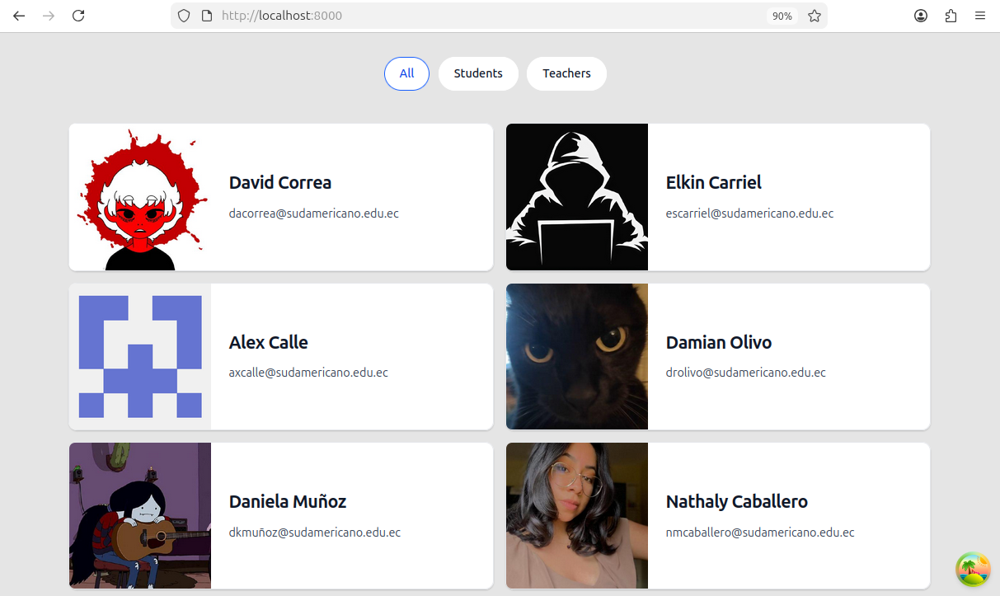
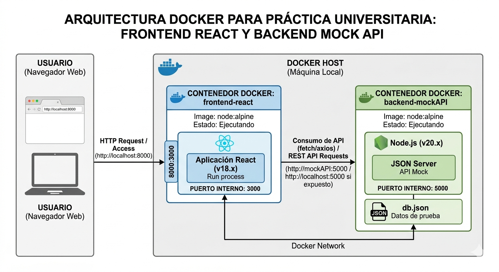
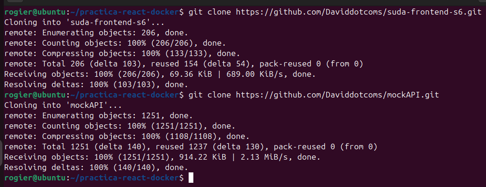
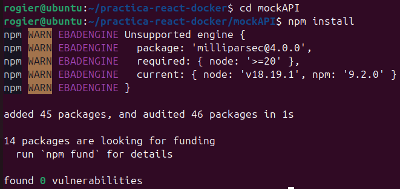
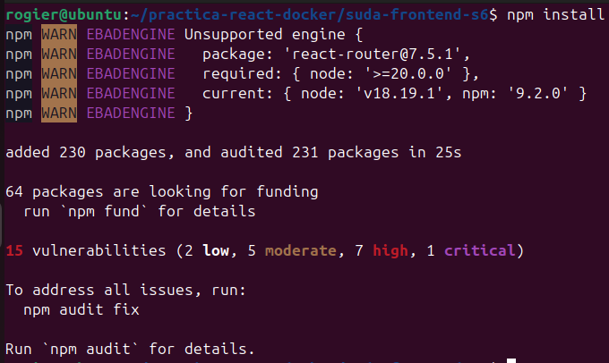
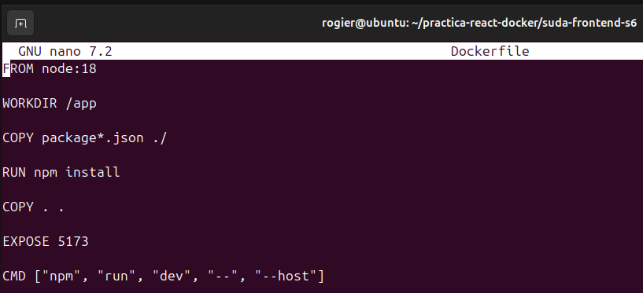
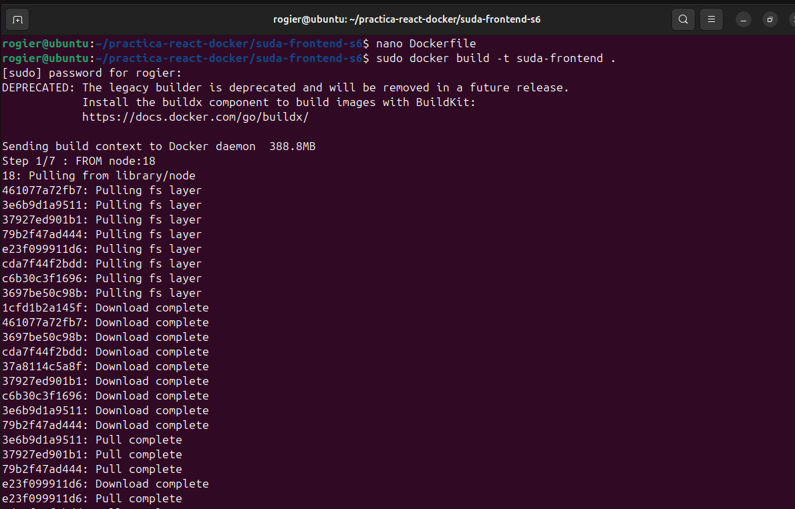
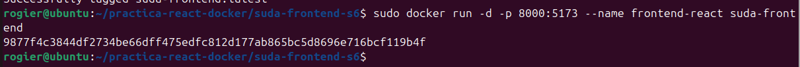
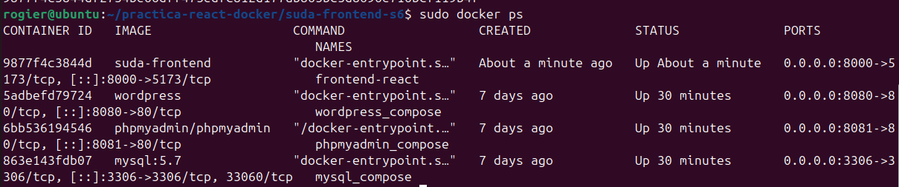

# Practica servidor web

# 1. Titulo

Contenerización de una aplicación React utilizando Docker y consumo de API simulada

# 2. Tiempo de duración

La práctica tuvo una duración aproximada de 100 minutos.

# 3. Fundamentos

Docker es una plataforma de virtualización basada en contenedores que permite desarrollar, ejecutar y desplegar aplicaciones de forma aislada y portátil. A diferencia de las máquinas virtuales tradicionales, los contenedores comparten el kernel del sistema operativo anfitrión, permitiendo un menor consumo de recursos y una mayor velocidad de ejecución.

Uno de los principales beneficios de Docker es que facilita la creación de entornos consistentes y reproducibles. Esto significa que una aplicación puede ejecutarse correctamente en diferentes computadores sin problemas de compatibilidad relacionados con dependencias o configuraciones del sistema operativo.

En esta práctica se trabajó con una aplicación frontend desarrollada en React y un backend simulado mediante JSON Server. React es una biblioteca de JavaScript utilizada para construir interfaces de usuario dinámicas e interactivas. Este tipo de aplicaciones normalmente requieren un backend para consumir datos, por lo que se utilizó el proyecto mockAPI como servicio backend de prueba.

El backend fue ejecutado utilizando Node.js y npm, herramientas ampliamente utilizadas para el desarrollo de aplicaciones JavaScript. Posteriormente, el frontend fue ejecutado localmente para comprobar su funcionamiento y comunicación con la API.

Una vez verificado el correcto funcionamiento de la aplicación, se procedió a contenerizar el frontend mediante Docker. Para ello se creó un archivo Dockerfile que permitió definir los pasos necesarios para construir una imagen Docker basada en Node.js. Finalmente, se creó un contenedor Docker exponiendo el puerto 8000 para acceder al frontend desde el navegador.

La práctica permitió comprender el proceso de contenerización de aplicaciones frontend modernas y la importancia de Docker en el despliegue de aplicaciones web.

# 4. Conocimientos previos

Para desarrollar esta práctica fue necesario tener conocimientos básicos sobre:

- Comandos básicos de Linux
- Uso de terminal Ubuntu
- Docker y contenedores
- Node.js y npm
- Git y GitHub
- Redes y puertos
- React
- Navegador web

# 5. Objetivos a alcanzar

- Clonar repositorios desde GitHub
- Ejecutar proyectos frontend y backend localmente
- Crear imágenes Docker
- Crear contenedores Docker
- Comprender el funcionamiento de Dockerfile
- Ejecutar aplicaciones React dentro de Docker

# 6. Equipo necesario

- Computador con Ubuntu Linux
- Docker instalado
- Node.js instalado
- npm instalado
- Git instalado
- Navegador web
- Conexión a internet
- Cuenta GitHub

# 7. Material de apoyo

- Documentación oficial de Docker
- Documentación oficial de React
- Documentación oficial de Node.js
- Documentación oficial de npm
- Repositorios proporcionados por el docente
- Cheat sheet Linux

# 8. Procedimiento

## Diagrama de arquitectura

A continuación se presenta el diagrama de arquitectura utilizado durante la práctica, mostrando la comunicación entre el frontend React, el backend mockAPI y Docker.

## Paso 1: Clonar repositorios

Se clonaron los repositorios correspondientes al frontend y backend utilizando GitHub.

## Paso 2: Instalar dependencias del backend

Se instalaron las dependencias necesarias del proyecto mockAPI utilizando npm install.

## Paso 3: Instalar dependencias del frontend

Posteriormente se instalaron las dependencias del proyecto frontend React.

## Paso 4: Ejecutar frontend localmente

Se ejecutó el proyecto React localmente utilizando npm run dev para comprobar su funcionamiento.

## Paso 5: Crear Dockerfile

Se creó el archivo Dockerfile necesario para construir la imagen Docker del frontend.

## Paso 6: Construir imagen Docker

Se utilizó el comando docker build para generar la imagen Docker llamada suda-frontend.

## Paso 7: Crear contenedor Docker

Posteriormente se creó el contenedor frontend-react utilizando el puerto 8000.

## Paso 8: Verificar contenedores activos

Se verificó el funcionamiento del contenedor mediante el comando docker ps.

## Paso 9: Verificar frontend en Docker

Finalmente se accedió desde el navegador al frontend ejecutándose dentro del contenedor Docker mediante el puerto 8000.

# 9. Resultados esperados

Como resultado de la práctica se logró ejecutar correctamente una aplicación React utilizando Docker. También se consiguió levantar un backend simulado utilizando JSON Server y verificar la comunicación entre frontend y backend.

Se comprendió el proceso de creación de imágenes Docker mediante Dockerfile y el despliegue de aplicaciones frontend dentro de contenedores. Además, se verificó el acceso al frontend mediante el puerto 8000 desde el navegador web.

La práctica permitió reforzar conocimientos sobre Docker, Node.js, npm y React, además de comprender mejor cómo funcionan los procesos de contenerización de aplicaciones modernas.

# 10. Bibliografía

Docker Inc. (2024). *Docker Documentation*. https://docs.docker.com/

Meta Platforms Inc. (2024). *React Documentation*. https://react.dev/

OpenJS Foundation. (2024). *Node.js Documentation*. https://nodejs.org/

npm Inc. (2024). *npm Documentation*. https://docs.npmjs.com/

GitHub. (2024). *GitHub Documentation*. https://docs.github.com/

Daviddotcoms. (2024). *suda-frontend-s6*. GitHub. https://github.com/Daviddotcoms/suda-frontend-s6

Daviddotcoms. (2024). *mockAPI*. GitHub. https://github.com/Daviddotcoms/mockAPI
